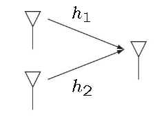

# 第一讲  
## 1G  
+ **A** network and **B** network  
+ Simulation system  
+ FDMA  
## 2G  
+ **C** network, **G** network and **D** network  
+ Digital system  
+ TDMA  
## 2.5G  
+ **GPRS**  
+ **EDGE**  
+ **WAP**  
## 3G  
+ **CDMA**  
## 4G  
+ **TD-LTE** and **FDD-LTE**  
+ **OFDM** 正交频分复用  
+ **MIMO**  
## 5G  
+ Cognitive Radio  
+ Spectrum Expansion Technology  
+ Massive MIMO  
+ ...课后题答案  
## 课后题答案  
1. which mobile communication systems suport MIMO Technology?  
  A: 4G & 5G  
2. What are the key transmission technologies of 5G(list at lease three)?  
  A:  
    + 认知无线电  
    + 频谱扩展技术  
    + 大规模MIMO  
    + 高级编码和调制技术  
    + 能源效率提升技术  
    + 网络覆盖增强技术  
# 第二讲  
## Model of Wireless Channel  
  + Path-Loss Model  
  + Shadowing Effect Model  
  + Rayleigh flat fading model  
  + Rician model   
## Capacity of AWGN channel  

##课后题答案  
1. If K=0dB, transmit power is 1w(watt), reference distance is 1 m, path-loss exponent is 3, and the distance between the transimitter and receiver is 10 m, what is the received power?  
    $$
    P_r(dBm)=P_t(dBm) + K(dB)-10\alpha log_{10}(\frac{d}{d0})
    $$
    **Notes**:K is a constant related to the antenna gain and the average change attenuation and a donates path-loss exponent  
    $$
    X=1000\space 000\space 000 \space watt \newline
    =10log_{10}X\space dB\newline
    =90dB
    \newline
    \newline
    Y=1000 \space mwatt
    \newline
    =10log_{10}{1000}\space dBm
    \newline
    =30dBm
    $$
所以：  
    A:  
    $$
        Pt=1w = 1000 mw=10*log_{10}1000 dBm=30dBm\newline
        K = 0dB\newline
        \alpha = 3\newline
        d=10m\newline
        d0=1m\newline
        Pr=30+0-10*3*log_{10}(\frac{10}{1})=0
    $$
2. In the right Figure,h1=3, h2=4, what is the diversity gain?  
   

**diversity gain**: $\frac{1}{L}||h||^2$,  L 代表天线数，h是 (h1,h2)组成的向量  
A:  
$$
    \frac{1}{2}\sqrt{h_1^2+h_2^2}^2=12.5
$$
3. Compute the Capacity of an AWGN channel when SNR=20dB.  
**Capacity of AWGN channel**:  
$$
C_{awgn}=log(1+SNR)\space bits/s/Hz
$$
A:  
$$
SNR=20dB=10log_{10}100dB=100
C_{awgn}=log_{10}(100+1)=log_{10}101
$$
# 第三讲  

##***！！！！！！！！！不会！！！！！！！！***
1. If H=$\left[\begin{matrix} 2 && 1\\ 1 && 2 \end{matrix} \right]$,$K_x=\left[\begin{matrix}1&&0\\0&&1\\ \end{matrix} \right]$,the noise power $N_0=0dB$,compute the capacity of the AWGN MINO channel.  
$$
log\space det(I_{n_r}+\frac{1}{N_0}HK_xH^*)
\newline
=log\space det(\left[\begin{matrix}1&&0\\0&&1\\\end {matrix}\right]+\frac{1}{1}\left[\begin{matrix}2&&1\\1&&2\\\end {matrix}\right]\left[\begin{matrix}1&&0\\0&&1\\\end {matrix}\right]\left[\begin{matrix}2&&1\\1&&2\\\end {matrix}\right])
\newline
=log\space det(\left[\begin{matrix}6&&4\\4&&6\\\end {matrix}\right])
\newline
=log\space 20
$$
2. For the MIMO channel $y=Hx+w$, how to parallelize it?  
# 第四讲  
## The concept of Massive MIMO  
基站使用大规模的天线阵列，称为大规模MIMO  
1. What are the advantages of Massive MIMO technology?  
   + Capacity enhancement  
   + Mathematically Exact  
     + Required Tx energy/bit is arbitrarily ***small***  
     + ***Eliminate*** the effects of uncorrelated noise & fast fading  
     + ***Compensate*** the poor-quality CSI  
2. For a 100 × 4 Massive MIMO channel, when the transmit power Pd=10dB, what is the capacity?  
**注释**  
$$
C_{M>>N}=Nlog_2({1+P_d})
$$
$$
Pd=10dB=10^{\frac{10}{10}}=10\newline
C=4*log_2(1+Pd)=4*log_2(11)
$$
# 第五讲  
## Cognitive wireless networks  
## Spectrum sensing  
 快速可靠的发现可用频谱资源，是认知无线通信的基础。  
 + 直接感知  
 + 间接感知  
## Cognitive wireless transmission  
1. What kind of radio system is congnitive radio?  
   A:  
   **认知无线电**是可以通过与工作环境的交互，自主调整参数及其工作模式或工作方式的无线电系统。  
2. What are the methods of acquiring available spectrum resources in cognitive radio?  
   + 数据库  
   + 主用户系统发射信标信号  
   + 频谱感知  
3. What are the two application models of cognitive wireless transmission?  
   + 基于频谱空洞(overlay)  
   + 基于干扰门限(underlay)  

# 第六讲  

**可见光通信**  
## VLC Indoor application  
  + 移动对移动  
  + 移动对固定电话  
  + 移动对基础设施  
  + 固定电话对基础设施  
  

## Channel modelling of VLC  
1. Give some application examples of VLC.  
   + 外围接口  
   + 信息传播  
   + 禁止射频  
   + 可见局域网  
2. What are the General Characteristic of VLC?  
   + **Visibility**:美观  
   + **Security**：安全，所见即所发  
   + **Health**:对人体和电子设备无损害  
   + **Unregulated**:无管制  
   + **Using in the restricted area**:机场，太空船，医院  
   + **Eye safety**  
# 第七讲  
## Three "Canonical" Models/Modes of Wireless Powered Communication  
   + WPT：无线能量传输  
   + WPCN：无线能量通信网络   
   + SWIPT：同时无线信息和能量传输  
## Wireless Powered Communication Applications  
   + Internet of Things/Everything  
   + WPT使能频射识别  
   + WPT使能无线传感器网络  
  
1. What are the main Wireless Power Transfer(WPT) technologies?  
   + 电感耦合  
   + 磁共振耦合  
   + 电磁辐射  
   + 激光功率发射  
2. Give some application examples of WPT。  
   + 电子牙刷  
   + 无线供电高清电视  
   + 无线供电移动设备  
3. What are the advantages of Wireless Power Transfer(WPT) technologies over traditional energy supply methods?  
   + 方便  
   + 经济  
   + 环境友好  
# 第八讲  
***UAV Communication***：无人机通信  
**应用**：军事，交通管制，快递配送，直播，精准农业  
**UAV-Ground Channel Models**:  
   + Free space line-of-sight(Los) model  
   + Rician fading model  
   + Probabilistic Los model  
# 第九讲  
**通信**：信息的传送  
**光纤通信**：利用激光作为信息的载波信号，并通过光纤来传送信息的他通信系统。  
**光纤通信系统**：  
**光纤通信技术的主要优点**：  
   + 光波频率很高，光纤传输的频带很宽，故**传输容量很大**。  
   + 不受电磁干扰，保密性好。  
   + 耐高温，高压，抗腐蚀，工作可靠。  
   + 光纤材料来源丰富，且直径小，重量轻。  
**光纤网络的分类**  

|分类|focus on|
|------|-------|
|Long-haul|Capacity|
|Metro|Smart|
|Access|Cost|
